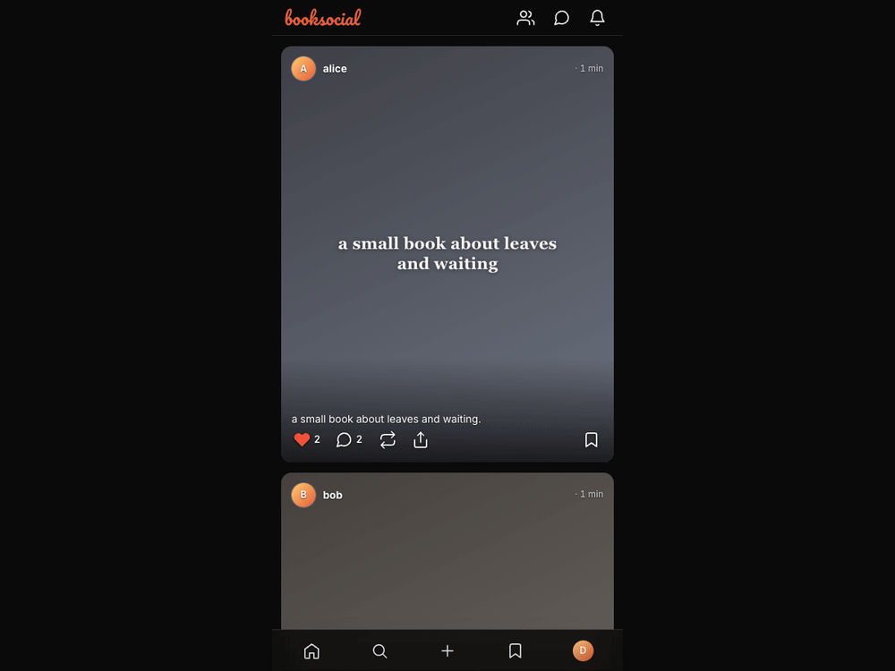

<div align="center">

# 📚 booksocial

### Instagram, shaped for reading.

Upload an EPUB and it becomes a post: a cover, a caption, and the book itself — parsed into chapters and paragraphs you can read right in the feed. Then the social layer kicks in: follow people, like and save, highlight passages, leave notes, start book clubs, and DM. A small, self-hosted Flask app.


[Overview](#overview) · [Features](#features) · [Architecture](#architecture) · [Stack](#tech-stack) · [Install](#installation) · [Usage](#usage) · [Config](#configuration) · [Develop](#development) · [Contributing](#contributing) · [License](#license) · [Support](#support)

</div>

---

<p align="center"></p>

## Overview

Reading apps are libraries; social apps are feeds. booksocial puts them together — your bookshelf *is* your profile, and reading is something you do with people. Drop in an EPUB; it's ingested into clean, sanitized HTML paragraphs (cover extracted, images localized) and posted to your feed for others to read, react to, and discuss.

## Features

- **EPUB → readable post** — `ebooklib` parses chapters and paragraphs; HTML is sanitized with `bleach`, covers and images extracted and resized with Pillow.
- **A real feed** — books from people you follow, with captions, covers, likes, saves, and comments.
- **In-app reader** — chapter table of contents, paragraph-level rendering, reading progress.
- **Highlights & notes** — mark passages and keep private notes, scoped per book.
- **Social graph** — follows, profiles, reposts, quotes.
- **Book clubs** — shared spaces around a read.
- **DMs & notifications** — direct messages and an activity inbox.

## Architecture

```
upload .epub ─▶ ebooklib parse ─▶ sanitize (bleach) + extract cover/images (Pillow)
            ─▶ chapters + paragraphs in SQLite ─▶ rendered in the feed & reader
```

Data model centers on `users`, `books` (with `chapters` and `paragraphs`), and the social tables (`follows`, `likes`, `saves`, `comments`, `highlights`, `notes`, `reading_progress`). Auth is delegated to a reverse proxy: the app trusts `Remote-User` / `Remote-Email` headers, so it sits cleanly behind a homelab SSO.

## Tech stack

| Layer | Choice |
|---|---|
| Server | Flask |
| Database | SQLite (WAL, foreign keys) |
| EPUB | ebooklib + BeautifulSoup |
| Sanitizing | bleach |
| Images | Pillow |

## Installation

```sh
pip install -r requirements.txt
python seed.py        # initialize the schema (+ demo data)
```

## Usage

```sh
DEV_MODE=1 flask --app app run
# open http://localhost:5000/?as=demo   (DEV_MODE picks the user from ?as=)
```

Upload an EPUB to create a post, then browse the feed, open the reader, highlight passages, follow other readers, and join clubs.

## Configuration

| Var | Default | Purpose |
|---|---|---|
| `DB_PATH` | `./books.db` | SQLite database file |
| `UPLOADS_DIR` | `./uploads` | Stored covers + extracted images |
| `DEV_MODE` | `1` | Local auth shortcut — picks the user from `?as=` / cookie |
| `Remote-User` / `Remote-Email` | – | Identity headers set by your reverse proxy in production |

## Development

In production, put booksocial behind a proxy that sets `Remote-User` and point `DB_PATH` / `UPLOADS_DIR` at persistent storage. Max upload size is 64 MB; uploaded HTML is always sanitized through the single `bleach` allow-list.

## FAQ

**What can I upload?**
EPUB files — `ebooklib` parses them into chapters and paragraphs, extracts the cover, and localizes images.

**How does login work?**
Identity comes from reverse-proxy headers (`Remote-User` / `Remote-Email`); locally, `DEV_MODE` picks the user from `?as=`.

**Is uploaded content sanitized?**
Yes — all HTML passes through a single `bleach` allow-list before it's stored or rendered.

## Contributing

Contributions are welcome — please read the [AI Contribution Policy](https://github.com/oabdrabo/.github/blob/main/AI_POLICY.md) first. Keep pull requests focused on a single concern, follow the existing conventions, and tests are very welcome.

## License

[MIT](LICENSE) © 2026 Omar Abdrabo

## Support

Free and open-source. If it's useful, you can support development — pay what you like, once or monthly:

[](https://donate.stripe.com/3cI6oI7Gh1PG0eV8MJ5kk00)
[](https://buy.stripe.com/00wbJ2f8J51S9Pv1kh5kk01)
