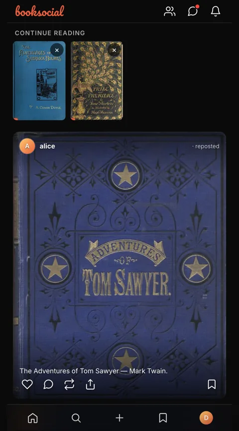
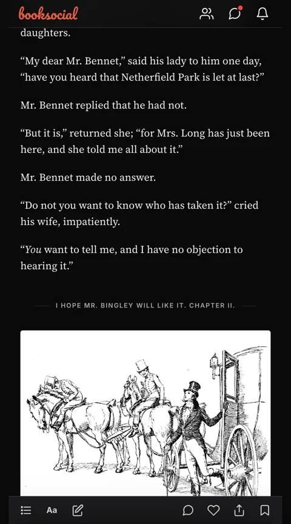
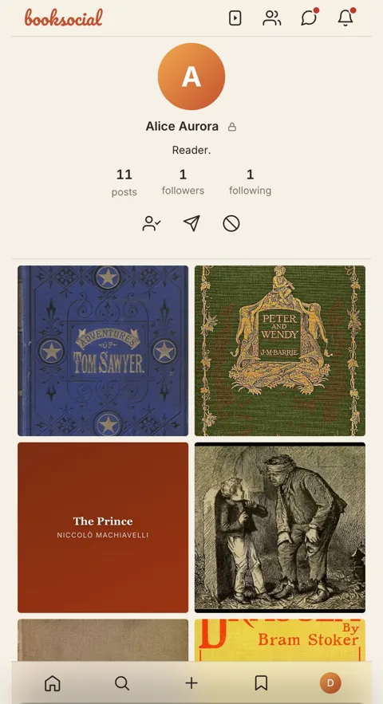
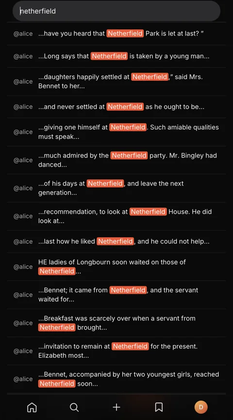
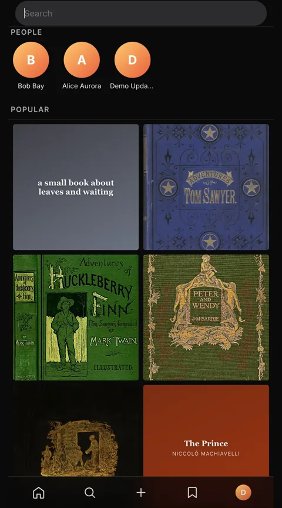
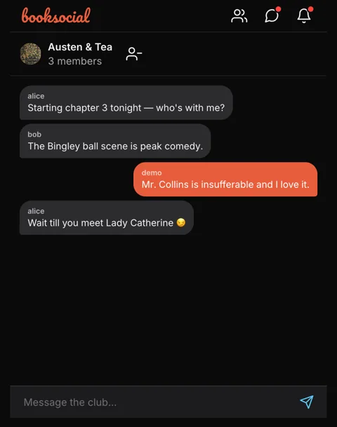
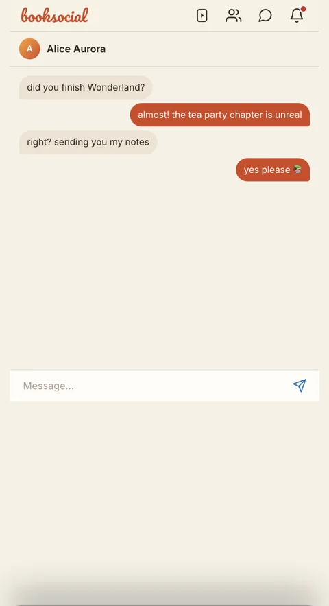
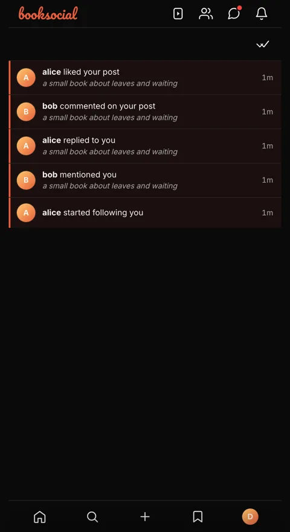
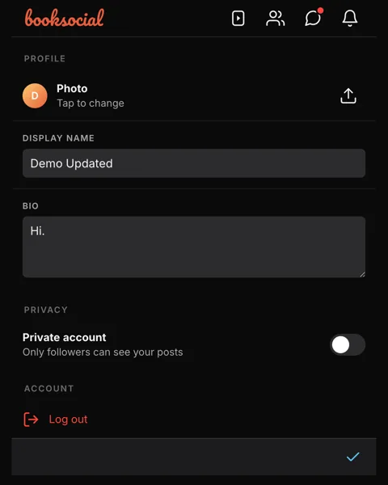

<div align="center">

<picture>
  <source media="(prefers-color-scheme: light)" srcset="assets/banner-light.png" />
  
</picture>

Upload an EPUB and it becomes a post: a cover, a caption, and the book itself — parsed into chapters and paragraphs you can read right in the feed. Then the social layer kicks in: follow people, like and save, highlight passages, leave notes, start book clubs, and DM. A small, self-hosted Flask app.


[Overview](#overview) · [Features](#features) · [Architecture](#architecture) · [Stack](#tech-stack) · [Install](#installation) · [Usage](#usage) · [Config](#configuration) · [Develop](#development) · [Contributing](#contributing) · [License](#license) · [Support](#support)

</div>

---

## Overview

Reading apps are libraries; social apps are feeds. booksocial puts them together — your bookshelf *is* your profile, and reading is something you do with people. Drop in an EPUB; it's ingested into clean, sanitized HTML paragraphs (cover extracted, images localized) and posted to your feed for others to read, react to, and discuss.

## Features

Every screen below is the real app, shown next to what it does.

<table>
<tr>
<td width="34%"></td>
<td><h3>📚 A feed of what your circle is reading</h3>
Books from people you follow (plus your own), newest first — with <b>likes</b>, <b>saves</b>, threaded <b>comments</b> (with <code>@mentions</code> and <code>#hashtags</code>), and <b>reposts</b> with quotes. A <b>continue-reading</b> shelf picks every book back up where you left off, and a separate <b>Explore</b> tab surfaces everything public.</td>
</tr>
<tr>
<td><h3>📖 Read right in the app</h3>
A serif reading view rendered paragraph by paragraph, with a chapter <b>table of contents</b>, localized inline images, and <b>reading progress</b> saved as you scroll. <b>Highlight</b> passages and attach <b>private notes</b> to individual paragraphs. Editing is <b>lossless</b> — your original Markdown is preserved.</td>
<td width="34%"></td>
</tr>
<tr>
<td width="34%"></td>
<td><h3>🗂️ Your bookshelf is your profile</h3>
Every profile is a <b>bookshelf grid</b> with stats — posts, followers, following, paragraphs read, and a <b>reading streak</b>. Books without artwork get a deterministic <b>generated cover</b> from their title, and any missing image degrades gracefully instead of breaking.</td>
</tr>
<tr>
<td><h3>🔎 Search inside the books</h3>
SQLite <b>FTS5</b> searches the text of the books themselves and returns <b>highlighted snippets</b> — not just titles — alongside matching captions and people.</td>
<td width="34%"></td>
</tr>
<tr>
<td width="34%"></td>
<td><h3>✨ Discover your next read</h3>
An empty search box becomes discovery: <b>popular</b> books, <b>people</b> to follow, and a <b>#tag</b> cloud. Hashtags written in captions are indexed automatically and get their own tag pages.</td>
</tr>
<tr>
<td><h3>👥 Read together in book clubs</h3>
Spin up a <b>book club</b> around any book and chat with members in a shared space — create, join, or leave. Clubs respect book visibility.</td>
<td width="34%"></td>
</tr>
<tr>
<td width="34%"></td>
<td><h3>✉️ Direct messages</h3>
One-to-one conversations with <b>read receipts</b> and unread badges — and <b>block-aware</b>, so a block actually stops the conversation.</td>
</tr>
<tr>
<td><h3>🔔 An activity inbox</h3>
Everything that happens to you in one place — <b>likes</b>, <b>comments</b>, <b>replies</b>, and <b>@mentions</b> — with unread indicators in the top bar.</td>
<td width="34%"></td>
</tr>
<tr>
<td width="34%"></td>
<td><h3>🔒 Privacy & control</h3>
Go <b>private</b> for followers-only visibility, <b>block</b> anyone (enforced across feeds, search, DMs, and clubs), and edit your <b>display name, bio, and avatar</b>.</td>
</tr>
</table>

**Built to self-host:** ingests EPUB/Markdown/`.txt` (chapters, paragraphs, covers, images via `ebooklib` + Pillow); **proxy auth** via `Remote-User` headers (SSO-ready), with a `DEV_MODE` shortcut locally; **SQLite** with WAL, foreign keys, and FTS5; all uploaded HTML sanitized through one `bleach` allow-list with a 64 MB cap; a mobile-first **HTMX** UI with native-feeling bottom sheets.

## Architecture

```
upload .epub ─▶ ebooklib parse ─▶ sanitize (bleach) + extract cover/images (Pillow)
            ─▶ chapters + paragraphs in SQLite ─▶ rendered in the feed & reader
```

Data model centers on `users`, `books` (with `chapters` and `paragraphs`), and the social tables (`follows`, `likes`, `saves`, `comments`, `highlights`, `notes`, `reading_progress`). Auth is delegated to a reverse proxy: the app trusts `Remote-User` / `Remote-Email` headers, so it sits cleanly behind a homelab SSO.

## Tech stack

| Layer | Choice |
|---|---|
| Server | Flask |
| Database | SQLite (WAL, foreign keys) |
| EPUB | ebooklib + BeautifulSoup |
| Sanitizing | bleach |
| Images | Pillow |

## Installation

```sh
pip install -r requirements.txt
python seed.py        # initialize the schema (+ demo data)
```

## Usage

```sh
DEV_MODE=1 flask --app app run
# open http://localhost:5000/?as=demo   (DEV_MODE picks the user from ?as=)
```

Upload an EPUB to create a post, then browse the feed, open the reader, highlight passages, follow other readers, and join clubs.

## Configuration

| Var | Default | Purpose |
|---|---|---|
| `DB_PATH` | `./books.db` | SQLite database file |
| `UPLOADS_DIR` | `./uploads` | Stored covers + extracted images |
| `DEV_MODE` | `1` | Local auth shortcut — picks the user from `?as=` / cookie |
| `Remote-User` / `Remote-Email` | – | Identity headers set by your reverse proxy in production |

## Development

In production, put booksocial behind a proxy that sets `Remote-User` and point `DB_PATH` / `UPLOADS_DIR` at persistent storage. Max upload size is 64 MB; uploaded HTML is always sanitized through the single `bleach` allow-list.

## FAQ

**What can I upload?**
EPUB files — `ebooklib` parses them into chapters and paragraphs, extracts the cover, and localizes images.

**How does login work?**
Identity comes from reverse-proxy headers (`Remote-User` / `Remote-Email`); locally, `DEV_MODE` picks the user from `?as=`.

**Is uploaded content sanitized?**
Yes — all HTML passes through a single `bleach` allow-list before it's stored or rendered.

## Contributing

Contributions are welcome — please read the [AI Contribution Policy](https://github.com/oabdrabo/.github/blob/main/AI_POLICY.md) first. Keep pull requests focused on a single concern, follow the existing conventions, and tests are very welcome.

## License

[MIT](LICENSE) © 2026 Omar Abdrabo

## Support

Free and open-source. If it's useful, you can support development — pay what you like, once or monthly:

[](https://donate.stripe.com/3cI6oI7Gh1PG0eV8MJ5kk00)
[](https://buy.stripe.com/00wbJ2f8J51S9Pv1kh5kk01)
